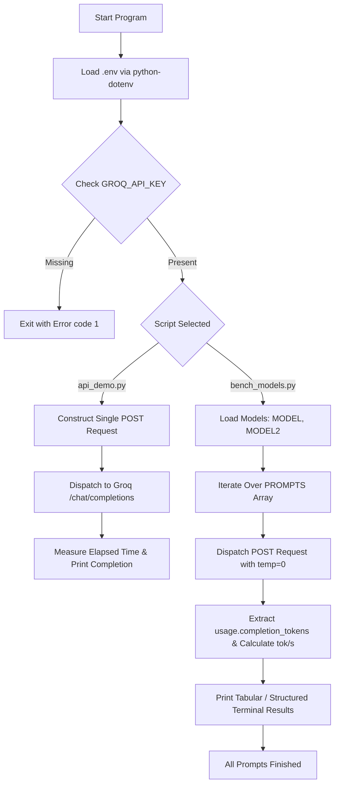

# Day 5 Lab: Local Ollama Model Customization & Cloud LLM API Benchmarking

## Overview

This repository contains the laboratory implementation for **Day 5** of the AI Fluency Training program. The project focuses on two core themes:
1. **Local LLM Customization via Ollama Modelfiles**: Defining custom system prompts, temperature parameters, context window sizes, and repetition penalties for locally hosted open-source models (such as `qwen2.5:1.5b`).
2. **REST API Integration and Benchmarking**: Programmatically querying OpenAI-compatible endpoints—specifically contrasting local Ollama endpoints (`/api/generate`, `/api/chat`, `/api/tags`, `/api/ps`, `/v1/chat/completions`) with cloud-hosted accelerated inference engines (Groq Cloud API). It measures latency, token generation count, throughput (tokens per second), and prompt compliance across models like `openai/gpt-oss-20b` and `openai/gpt-oss-120b`.

The primary problem solved is understanding how LLM behavioral parameters (temperature, system instructions, context window) alter model behavior, and how developer applications measure throughput and latency when interfacing with local versus cloud LLM execution tiers.

## Key Features

- **Declarative Ollama Modelfile Definitions**:
  - [Modelfile](file:///c:/Users/gokul/Documents/AI_FLUENCY_TRAINING/DAY_5/day5_lab/Modelfile): Configures a strict, conservative "college fee assistant" using `qwen2.5:1.5b`, `temperature 0`, `num_ctx 8192`, `repeat_penalty 1.1`, with negative prompting and brevity constraints (under 30 words).
  - [Modelfile.creative](file:///c:/Users/gokul/Documents/AI_FLUENCY_TRAINING/DAY_5/day5_lab/Modelfile.creative): Configures an "enthusiastic college events announcer" using `temperature 1.2` and `num_ctx 2048` requiring excited tone with at least three exclamation marks.
- **REST API Interaction Script ([api_demo.py](file:///c:/Users/gokul/Documents/AI_FLUENCY_TRAINING/DAY_5/day5_lab/api_demo.py))**:
  - Connects to an OpenAI-compatible `/chat/completions` endpoint (Groq API by default, with preserved implementations for local Ollama endpoints).
  - Measures end-to-end elapsed response time and prints returned text completions.
  - Implements full request error handling and API key checks.
- **Multi-Model Quantitative Benchmarking ([bench_models.py](file:///c:/Users/gokul/Documents/AI_FLUENCY_TRAINING/DAY_5/day5_lab/bench_models.py))**:
  - Iterates over a defined suite of test prompts targeting strict instruction adherence, concise conceptual explanation, and multi-step arithmetic reasoning.
  - Tests multiple models loaded via environment variables (`MODEL` and `MODEL2`).
  - Records execution metrics: wall-clock latency (seconds), total completion tokens, and generation throughput (tokens/second).
- **Execution Verification Artifacts**:
  - Screenshots in the `output screen/` folder documenting live terminal execution and evaluation metrics.

## Project Architecture

```
day5_lab/
├── .env                  # Environment configuration (provider, API keys, model selections)
├── .gitignore             # Git ignore patterns (.env, .venv/, __pycache__/, *.pyc)
├── Modelfile              # Ollama customization file: strict fee assistant (temp 0, num_ctx 8192)
├── Modelfile.creative     # Ollama customization file: creative announcer (temp 1.2, num_ctx 2048)
├── api_demo.py            # API query script for OpenAI-compatible REST endpoints (Groq / Ollama)
├── bench_models.py        # Benchmark suite evaluating latency, token counts, and tokens/sec
├── requirements.txt       # Python runtime dependencies (openai, python-dotenv, requests)
├── output screen/         # Terminal execution screenshots
│   ├── api_demo.py/
│   │   └── Screenshot 2026-10-01 215253.png
│   └── bench_models.py/
│       ├── Screenshot 2026-10-01 215346.png
│       └── Screenshot 2026-10-01 215349.png
├── README.md              # Project documentation and reproduction guide
└── analysis.md            # Detailed technical, architectural, and evaluation report
```

## How It Works

1. **Model Specification (Ollama Modelfiles)**:
   - Ollama reads a `Modelfile` specifying a base model (`FROM qwen2.5:1.5b`), runtime parameters (`PARAMETER temperature <val>`, `PARAMETER num_ctx <val>`), and a `SYSTEM` prompt.
   - Built locally via `ollama create <name> -f <Modelfile>`.
2. **API Invocation (`api_demo.py`)**:
   - Loads environment variables from `.env` using `python-dotenv`.
   - Validates that `GROQ_API_KEY` exists.
   - Dispatches an HTTP `POST` request to `https://api.groq.com/openai/v1/chat/completions` containing the model name, user message, and `temperature: 0`.
   - Calculates round-trip request time and prints the completion content.
3. **Benchmarking Execution (`bench_models.py`)**:
   - Loads models specified in `MODEL` (default: `openai/gpt-oss-120b`, overridden in `.env` to `openai/gpt-oss-20b`) and `MODEL2` (default: `openai/gpt-oss-20b`, overridden in `.env` to `openai/gpt-oss-120b`).
   - Dispatches 3 benchmark prompts sequentially for each model:
     - Exact token adherence: `"Reply with exactly: OK"`
     - Concise conceptual reasoning: `"In two sentences, what is an AI agent?"`
     - Step-by-step arithmetic: `"A course costs Rs. 18,000. A 15% scholarship is applied. Calculate the scholarship amount and the final payable amount. Show the calculation step by step. Give the final payable amount clearly."`
   - Parses the completion tokens from the API response payload `usage.completion_tokens`, computes `rate = tokens / elapsed`, and displays metrics.

## Technologies Used

- **Language**: Python 3.14+
- **Inference Runtime & Frameworks**:
  - **Ollama Engine**: Local execution via Modelfile configurations (`qwen2.5:1.5b`).
  - **Groq Cloud API**: High-speed OpenAI-compatible hosted inference provider.
- **Models Evaluated**:
  - `qwen2.5:1.5b` (Local Modelfile base target)
  - `openai/gpt-oss-20b` (Active via Groq)
  - `openai/gpt-oss-120b` (Active via Groq)
- **HTTP Client**: `requests` (synchronous HTTP requests)
- **Environment Management**: `python-dotenv`
- **OpenAI Compatibility**: `openai>=1.40.0` (declared in requirements)

## Installation

### 1. Clone or Open Workspace
Navigate to the project root directory:
```powershell
cd c:\Users\gokul\Documents\AI_FLUENCY_TRAINING\DAY_5\day5_lab
```

### 2. Configure Virtual Environment
Activate the existing virtual environment or create a new one:
```powershell
# To create a fresh virtual environment:
python -m venv .venv

# Activate on Windows PowerShell:
.venv\Scripts\Activate.ps1
```

### 3. Install Python Dependencies
```powershell
pip install -r requirements.txt
```

### 4. (Optional) Install Ollama for Local Modelfile Execution
If running the local Ollama sections:
- Download and install Ollama from [ollama.com](https://ollama.com).
- Pull base model:
  ```powershell
  ollama pull qwen2.5:1.5b
  ```
- Build custom models from Modelfiles:
  ```powershell
  ollama create fee-assistant -f Modelfile
  ollama create event-announcer -f Modelfile.creative
  ```

## Environment Variables

Create or update a `.env` file in the project root:

```ini
PROVIDER=groq
GROQ_API_KEY=your_groq_api_key_here
MODEL=openai/gpt-oss-20b
MODEL2=openai/gpt-oss-120b
```

> **Security Note:** Never commit actual API keys to version control. The `.gitignore` file is configured to exclude `.env`.

## Running the Project

### 1. Run the Single-Call REST API Demo
```powershell
python api_demo.py
```

### 2. Run the Multi-Model Benchmark Suite
```powershell
python bench_models.py
```

## Example Usage

### `python api_demo.py` Output
```text
Calling Groq API with model: openai/gpt-oss-20b...

[/v1/chat/completions] Response in 0.99s:
An AI agent is a software entity that perceives its environment through sensors or data inputs, processes that information using algorithms or models, and takes actions to achieve goals or solve problems. It can learn from experience, adapt its behavior, and interact with humans or other systems. Essentially, it acts autonomously or semi-autonomously to perform tasks that would otherwise require human intelligence.
```

### `python bench_models.py` Output Snippet
```text
========================================================================
MODEL: openai/gpt-oss-20b

  prompt: Reply with exactly: OK
  0.6 s |   41 tokens |  65.8 tok/s | load     0.0 ms
  answer: OK

  prompt: In two sentences, what is an AI agent?
  0.9 s |  203 tokens | 222.8 tok/s | load     0.0 ms
  answer: An AI agent is a software system that perceives its environment through sensors, processes data using artificial intelligence algorithms, and takes actions to achieve specified goals. It can learn from experience, adapt to new situations, and interact autonomously with humans or other agents.

  prompt: A course costs Rs. 18,000. A 15% scholarship is ap
  0.8 s |  191 tokens | 235.5 tok/s | load     0.0 ms
  answer: **Step-by-step calculation**

| Step | Description | Formula | Result |
|---|---|---|---|
| 1 | **Original course cost** | - | Rs. 18,000 |
| 2 | **Scholarship percentage** | - | 15 % |
| 3 | **Scholarship amount** | \(18,000 \times 0.15\) | Rs. 2,700 |
| 4 | **Final payable amount** | \(18,000 - 2,700\) | Rs. 15,300 |

---

**Final payable amount:** **Rs. 15,300**
```

## Project Workflow



## Testing

- **Automated Unit / Integration Tests**: Not implemented (no pytest / unittest test suite files present).
- **Manual Verification**: Performed via live script execution and documented in `output screen/`:
  - `output screen/api_demo.py/Screenshot 2026-10-01 215253.png` confirms `api_demo.py` execution against Groq API in 0.99s.
  - `output screen/bench_models.py/Screenshot 2026-10-01 215346.png` and `Screenshot 2026-10-01 215349.png` confirm benchmarking execution across both models (`openai/gpt-oss-20b` and `openai/gpt-oss-120b`).

## Limitations

1. **No Agentic Tool-Use or Agent Loop**: The project queries plain completion APIs; it does not implement tool calling, function execution, memory persistence, or iterative reasoning loops.
2. **Commented Local Ollama Endpoints**: The local Ollama routines in `api_demo.py` and `bench_models.py` are commented out in favor of Groq API calls; running them requires manual uncommenting and an active local Ollama daemon.
3. **Synchronous Requests**: HTTP calls are made sequentially using standard synchronous `requests`, blocking between model queries instead of running concurrent benchmarks.
4. **No Automated Regression Tests**: Evaluation relies entirely on manual terminal output and visual inspection.
5. **Hardcoded Benchmark Prompts**: Prompts are statically declared in an in-memory list rather than loaded dynamically from configuration files or evaluation datasets.

## Future Improvements

- Implement an automated test suite (`pytest`) checking API schema conformance and status codes.
- Implement asynchronous HTTP client (`httpx` or `aiohttp`) for concurrent multi-model benchmarking.
- Create a CLI argument parser (`argparse` or `click`) allowing runtime switching between local Ollama and Groq without modifying code.
- Add structured JSON or CSV output export for benchmark metrics (latency, tokens, tok/s).
- Introduce tool calling and agentic feedback loops into `api_demo.py`.

## Author / Project Information

- **Course**: AI Fluency Training — Day 5 Laboratory
- **Author/Student**: GOKULAKRISHNA-S (7376251CS187)
- **Repository**: `AI-FLUENCY-TRAINING-7376251CS187`
