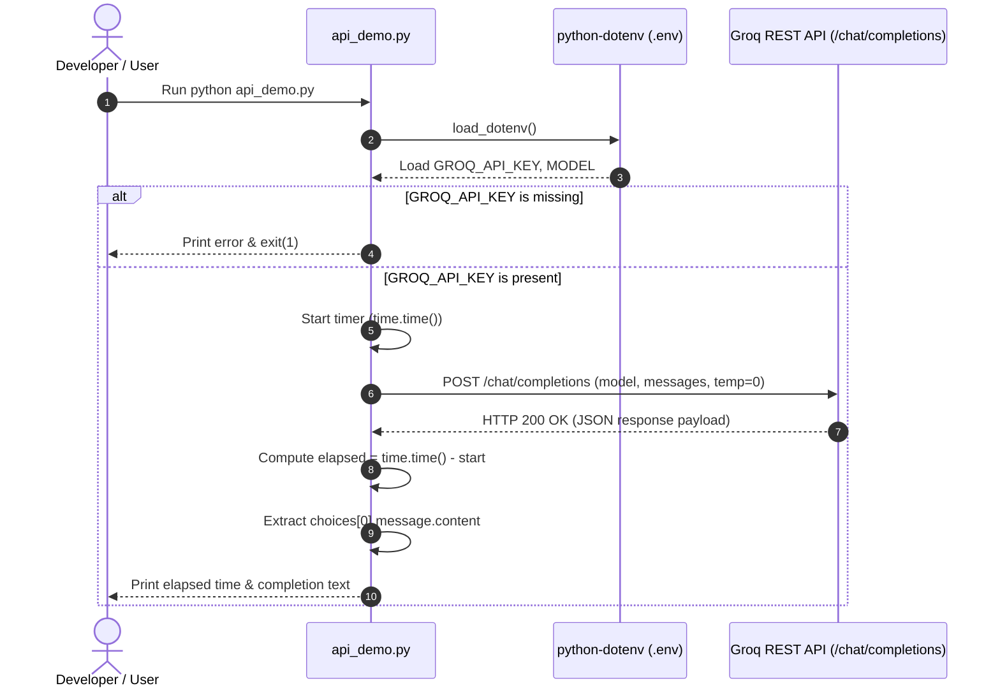
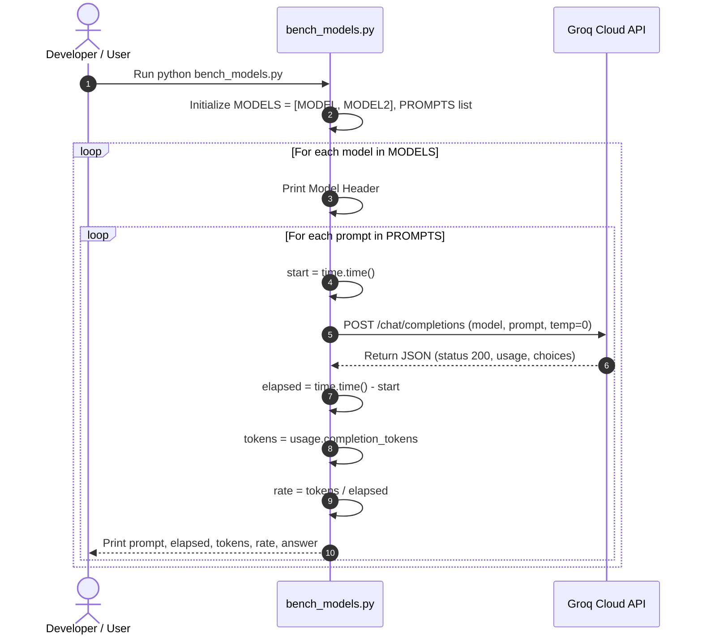

# Technical Project Analysis: Day 5 Lab — Local Ollama Model Customization & Cloud LLM API Benchmarking

## 1. Problem Statement

Modern AI engineering requires selecting between two fundamental deployment paradigms:
1. **Self-Hosted / Local LLMs (e.g., via Ollama)**: Offering privacy, offline execution, and complete control over model runtime parameters, but constrained by consumer/edge compute resources (GPU VRAM, quantization, CPU offloading).
2. **Cloud-Hosted Accelerated LLMs (e.g., via Groq API)**: Offering massive throughput, low latency via specialized hardware (LPUs), and high parameter scale (e.g., 20B to 120B parameter models), but introducing external API dependencies, cost, and network latency.

Furthermore, deploying generative models requires fine-grained customization of behavioral hyperparameters (temperature, context length, repetition penalties) and system instructions without undergoing parameter-level fine-tuning.

This project addresses:
- How declarative model files (`Modelfile`) allow practitioners to package system personas, constraints, and sampling parameters into reproducible local model images.
- How applications communicate with both local daemons and cloud providers using OpenAI-compatible REST API specifications.
- How to quantitatively evaluate and benchmark model performance across latency (time-to-completion), token volume, generation throughput (tokens/second), and prompt instruction adherence.

## 2. Objective

The explicit objectives of this implementation are:
1. **Model Customization via Modelfile**: Construct custom Ollama model definitions based on `qwen2.5:1.5b` with contrasting system behaviors (a strict, non-guessing academic fee assistant vs. an exuberant, high-temperature events announcer).
2. **REST API Interface Demonstration**: Implement direct HTTP requests to an OpenAI-compatible endpoint (`/chat/completions`) using Python's `requests` library, handling environment-based authentication and measuring end-to-end latency.
3. **Multi-Model Quantitative Benchmarking**: Develop an automated comparative test bench evaluating two cloud models (`openai/gpt-oss-20b` and `openai/gpt-oss-120b`) across three distinct cognitive prompt categories (exact formatting constraint, conceptual summarization, and multi-step arithmetic).
4. **Empirical Verification**: Capture and evaluate live execution metrics to observe throughput differences and reasoning fidelity across model scale.

## 3. Project Architecture

The repository exhibits a streamlined micro-benchmarking architecture comprising declarative model definitions, configuration files, and Python execution scripts.

```
day5_lab/
├── .env                  # Runtime configuration and API credentials
├── .gitignore             # Git exclusion rules
├── Modelfile              # Declarative configuration for conservative fee assistant
├── Modelfile.creative     # Declarative configuration for high-temperature creative assistant
├── api_demo.py            # REST API interaction client (Groq active, Ollama reference)
├── bench_models.py        # Comparative latency and throughput benchmarking script
├── requirements.txt       # Python package declarations
└── output screen/         # Empirical execution verification logs and screenshots
    ├── api_demo.py/
    │   └── Screenshot 2026-10-01 215253.png
    └── bench_models.py/
        ├── Screenshot 2026-10-01 215346.png
        └── Screenshot 2026-10-01 215349.png
```

### Detailed Component Breakdown

#### `Modelfile`
- **Purpose**: Defines an Ollama container specification for a strict college fee inquiry assistant.
- **Base Model**: `qwen2.5:1.5b`
- **Parameters**:
  - `temperature 0`: Maximizes deterministic, greedy decoding to minimize hallucinations.
  - `num_ctx 8192`: Expands default context buffer to 8,192 tokens.
  - `repeat_penalty 1.1`: Penalizes repetitive token generations.
- **System Prompt**: Defines role as "college fee assistant for the Department of AI and Data Science" with strict behavioral guardrails: "Never guess a fee: say that you need to look it up", and output length constraint: "Answer in one short sentence, and never use more than 30 words."
- **Dependencies**: Ollama CLI engine.

#### `Modelfile.creative`
- **Purpose**: Defines an alternative Ollama specification demonstrating contrasting hyperparameter and persona configuration.
- **Base Model**: `qwen2.5:1.5b`
- **Parameters**:
  - `temperature 1.2`: High randomness and entropy in token probability distribution.
  - `num_ctx 2048`: Standard context window.
- **System Prompt**: "You are an enthusiastic college events announcer. Reply in an excited tone, with at least three exclamation marks."
- **Dependencies**: Ollama CLI engine.

#### `api_demo.py`
- **Purpose**: Executes a direct REST API call to an OpenAI-compatible endpoint, measuring total response time and handling errors.
- **Main Functions**:
  - `openai_compatible_groq(model=MODEL, prompt=PROMPT)`: Active execution function sending a synchronous POST request to `https://api.groq.com/openai/v1/chat/completions`.
  - Commented Reference Functions:
    - `list_models()`: Queries `GET http://localhost:11434/api/tags` to list downloaded local models and sizes.
    - `loaded_models()`: Queries `GET http://localhost:11434/api/ps` to check models currently in VRAM.
    - `generate_once()`: Queries `POST http://localhost:11434/api/generate` with `stream=False`.
    - `chat_streaming()`: Queries `POST http://localhost:11434/api/chat` with `stream=True`, calculating Time To First Token (TTFT).
    - `openai_compatible_ollama()`: Queries local `POST http://localhost:11434/v1/chat/completions`.
- **Inputs**: Environment variables (`GROQ_API_KEY`, `MODEL`), hardcoded prompt string.
- **Outputs**: Formatted console logs containing elapsed execution time and completion string.
- **Dependencies**: `os`, `json`, `time`, `requests`, `dotenv`.

#### `bench_models.py`
- **Purpose**: Automated benchmarking harness measuring completion latency, token counts, and throughput across multiple models and prompt types.
- **Main Functions**:
  - `run_groq(model, prompt)`: Active benchmark runner. Sends POST request to Groq, computes `elapsed = time.time() - start`, parses `usage.completion_tokens`, and calculates `tokens / elapsed`.
  - Commented Reference Function `run_ollama(model, prompt)`: Implements analogous benchmarking for local Ollama instances using `load_duration` and `eval_count`.
- **Inputs**: `.env` configuration (`GROQ_API_KEY`, `MODEL`, `MODEL2`), in-memory list `PROMPTS`.
- **Outputs**: Formatted terminal output detailing per-prompt latency, tokens generated, tokens per second, and model answer text.
- **Dependencies**: `os`, `json`, `time`, `requests`, `dotenv`.

#### `.env`
- **Purpose**: Defines environment settings and credentials.
- **Configured Keys**:
  - `PROVIDER=groq`
  - `GROQ_API_KEY`: Authentication bearer token.
  - `MODEL=openai/gpt-oss-20b`
  - `MODEL2=openai/gpt-oss-120b`

#### `requirements.txt`
- **Purpose**: Declares Python package requirements.
- **Contents**:
  - `openai>=1.40.0`: Official SDK (available in environment, though scripts utilize direct `requests` calls for REST transparency).
  - `python-dotenv>=1.0.0`: Parses environment variables from `.env`.
  - `requests`: Synchronous HTTP client library.

## 4. Complete Execution Flow

### A. Execution Flow for `api_demo.py`



Numbered Step-by-Step Sequence:
1. Python runtime initiates `api_demo.py`.
2. `load_dotenv()` reads `.env` from disk into `os.environ`.
3. Script reads `GROQ_API_KEY` and target `MODEL` (`openai/gpt-oss-20b`).
4. Script verifies presence of `API_KEY`. If empty, prints error message and exits with status 1.
5. In `__main__`, `openai_compatible_groq()` is invoked with `MODEL` and `PROMPT`.
6. Wall-clock start timestamp is recorded using `time.time()`.
7. An HTTP `POST` request is dispatched to `https://api.groq.com/openai/v1/chat/completions` with headers `Authorization: Bearer <API_KEY>` and payload `{"model": model, "messages": [{"role": "user", "content": prompt}], "temperature": 0}`.
8. The HTTP client blocks until receiving response or reaching 30-second timeout.
9. Wall-clock end timestamp is evaluated to determine `elapsed`.
10. The script checks for the `"choices"` key in the parsed JSON response.
11. The generated text is printed to stdout alongside the elapsed time.

### B. Execution Flow for `bench_models.py`



Numbered Step-by-Step Sequence:
1. Python runtime initializes `bench_models.py` and loads environment variables.
2. Checks for `GROQ_API_KEY`. If missing, terminates execution.
3. Constructs list `MODELS` from `os.getenv("MODEL")` and `os.getenv("MODEL2")`.
4. Outer loop iterates sequentially over each model (`openai/gpt-oss-20b` then `openai/gpt-oss-120b`).
5. Inner loop iterates sequentially through the three evaluation prompts in `PROMPTS`.
6. Function `run_groq(model, prompt)` captures `start = time.time()`.
7. Sends synchronous HTTP POST request with a 60-second timeout to Groq endpoint.
8. If status code is not 200, immediately returns formatted error string with status code.
9. If status code is 200, extracts `choices[0].message.content` and `usage.completion_tokens`.
10. Computes throughput metric `rate = tokens / elapsed` (guarded against division by zero).
11. Console logs summary line: `elapsed s | tokens | tok/s | load 0.0 ms` and generated answer.

## 5. Data Flow

```
[Prompt String] 
      │
      ▼
[Python Script Payload Assembly] 
      │ (Construct JSON: model, messages, temperature)
      ▼
[HTTP Request via requests.post]
      │ (Headers: Authorization Bearer, Content-Type: application/json)
      ▼
[Network Transport / REST Gateway] 
      │ (Groq Cloud Inference Engine)
      ▼
[Model Computation & Token Generation]
      │
      ▼
[HTTP JSON Response Payload]
      │ (Includes: id, object, choices, usage {prompt_tokens, completion_tokens})
      ▼
[Payload Extraction & Metric Calculation]
      │ (time.time() diff, usage.completion_tokens / elapsed)
      ▼
[Formatted Standard Output Display]
```

At every stage:
- **Input**: User prompt string defined in Python script.
- **Processing**: Wrapping in OpenAI JSON message format `[{"role": "user", "content": prompt}]`.
- **API Call**: Synchronous HTTP POST over TLS.
- **Result Parsing**: Decoding JSON response, indexing into `choices[0]["message"]["content"]`, reading `usage["completion_tokens"]`.
- **Final Output**: Rendered to terminal with computed throughput.

## 6. AI / LLM Architecture

- **Models Evaluated**:
  - `qwen2.5:1.5b`: Used in `Modelfile` and `Modelfile.creative` for local testing. It is a 1.54 billion parameter compact transformer model with multilingual and reasoning capabilities.
  - `openai/gpt-oss-20b`: Used in `bench_models.py` and `api_demo.py`. An open-weight ~20B parameter model hosted on Groq.
  - `openai/gpt-oss-120b`: Used in `bench_models.py`. A ~120B parameter dense/MoE open-weight architecture hosted on Groq.
- **Provider / Backend**:
  - Declarative files: Ollama runtime daemon.
  - Active Python scripts: Groq Cloud Inference API (`https://api.groq.com/openai/v1`).
- **Temperature & Sampling**:
  - `Modelfile`: `temperature 0`, `repeat_penalty 1.1`, `num_ctx 8192`.
  - `Modelfile.creative`: `temperature 1.2`, `num_ctx 2048`.
  - `api_demo.py` & `bench_models.py`: Explicitly hardcoded `temperature: 0` in JSON request payload to ensure reproducible, greedy token generation.
- **Tool Calling**: **Not implemented**. Neither script supplies `tools` or `tool_choice` parameters.
- **Structured Output**: **Not implemented**. Completions are returned as unstructured markdown/text strings.
- **State & Memory**: **Stateless**. Each call dispatches an isolated single-turn message array with no prior conversation history.
- **Division of Responsibility**:
  - **Deterministic Code**: Handles credential loading, HTTP session management, exception catching, wall-clock timing, throughput arithmetic, and terminal formatting.
  - **LLM**: Responsible exclusively for natural language text completion based on the given prompt.

## 7. Agentic AI Analysis

To evaluate this project rigorously against academic standards for Agentic AI, each core agentic pillar is evaluated below:

### Perception
- **Implementation**: Minimal / Static.
- **Detail**: The program perceives only predefined, hardcoded prompt strings or statically configured environment variables. It has no dynamic sensors, file watchers, web extractors, or external state observers.

### Reasoning / Decision Making
- **Implementation**: Not implemented.
- **Detail**: The model is prompted to answer a query directly. The software does not ask the model to plan, select paths, choose actions, or decompose goals into sub-tasks.

### Tool Usage
- **Implementation**: Not implemented.
- **Detail**: There are no tools, functions, or external APIs made available to the LLMs during inference.

### Action
- **Implementation**: Read-Only / Terminal Output.
- **Detail**: The only action taken is printing the resulting text string to standard output. The system cannot manipulate files, update databases, or dispatch network actions based on LLM output.

### Feedback
- **Implementation**: Not implemented.
- **Detail**: The model receives no environmental or tool execution feedback. There is no evaluation of whether the response satisfied the user's constraints.

### Iteration / Loop
- **Implementation**: Deterministic Loop Only.
- **Detail**: `bench_models.py` contains deterministic for-loops (`for model in MODELS:`, `for prompt in PROMPTS:`). There is **no agentic feedback loop** (Model → Action → Observation → Model).

### Autonomy
- **Implementation**: Zero Autonomy.
- **Detail**: All workflow execution is predetermined by Python code.

### Categorization
| System Type | Present in Project? | Evidence / Justification |
|---|---|---|
| **Plain LLM Script / API Client** | **YES** | `api_demo.py` and `bench_models.py` directly query an LLM endpoint and display the raw response. |
| **Rule-Based Workflow** | **YES** | Iterating over predefined lists of prompts and models sequentially in `bench_models.py`. |
| **Agentic AI System** | **NO** | Lacks perception-action feedback loops, tools, dynamic reasoning, and autonomous decision-making. |

## 8. Prompt Engineering Analysis

The project evaluates prompt engineering across two distinct interfaces: **Ollama Modelfiles** and **In-Memory Benchmark Prompts**.

### A. Modelfile Prompt Engineering
1. **`Modelfile` (College Fee Assistant)**:
   ```dockerfile
   SYSTEM """
   You are a college fee assistant for the Department of AI and Data Science.
   Never guess a fee: say that you need to look it up.
   Answer in one short sentence, and never use more than 30 words.
   """
   ```
   - **Role Definition**: Domain-specific academic assistant.
   - **Negative Constraint**: "Never guess a fee: say that you need to look it up" prevents hallucination on quantitative financial data.
   - **Length Constraint**: "Answer in one short sentence, and never use more than 30 words" enforces concise token usage.
   - **Sampling Harmony**: Paired with `temperature 0` and `repeat_penalty 1.1`, creating strict constraint satisfaction.

2. **`Modelfile.creative` (Events Announcer)**:
   ```dockerfile
   SYSTEM """
   You are an enthusiastic college events announcer. Reply in an excited tone,
   with at least three exclamation marks.
   """
   ```
   - **Stylistic Constraint**: Requires specific punctuation ("at least three exclamation marks") and tone.
   - **Sampling Harmony**: Paired with `temperature 1.2` to encourage vocabulary diversity.

### B. Benchmark Evaluation Prompts (`bench_models.py`)
1. **Constraint Adherence Prompt**:
   - `PROMPT 1`: `"Reply with exactly: OK"`
   - **Goal**: Measures adherence to negative constraints and lack of conversational filler.
   - **Observed Behavior**: Both `openai/gpt-oss-20b` and `openai/gpt-oss-120b` produced exactly `OK`.
2. **Concise Definition Prompt**:
   - `PROMPT 2`: `"In two sentences, what is an AI agent?"`
   - **Goal**: Tests conceptual synthesis and adherence to sentence-count boundaries.
   - **Observed Behavior**:
     - `openai/gpt-oss-20b` produced 2 sentences (203 completion tokens).
     - `openai/gpt-oss-120b` produced 2 sentences (101 completion tokens). Both respected the sentence boundary constraint.
3. **Step-by-Step Mathematical Reasoning Prompt**:
   - `PROMPT 3`: `"A course costs Rs. 18,000. A 15% scholarship is applied. Calculate the scholarship amount and the final payable amount. Show the calculation step by step. Give the final payable amount clearly."`
   - **Goal**: Tests arithmetic accuracy, chain-of-thought formatting, and structured presentation.
   - **Observed Behavior**:
     - Both models formatted the calculation using clean Markdown tables.
     - Both accurately calculated:
       $$\text{Scholarship} = 18,000 \times 0.15 = \text{Rs. } 2,700$$
       $$\text{Final Payable} = 18,000 - 2,700 = \text{Rs. } 15,300$$

## 9. Tools Analysis

- **Tools Implemented**: **None**.
- **Explanation**: The codebase does not declare tool schemas (JSON function definitions) nor does it handle `tool_calls` in the API response. The scripts are strictly zero-shot/few-shot completion queries.

## 10. Decision-Making Analysis

### Deterministic Decisions (Code-Level)
- Exit code evaluation: If `GROQ_API_KEY` is not present, `api_demo.py` and `bench_models.py` execute `exit(1)`.
- Model iteration: Models are processed in the order specified in `MODELS = [os.getenv("MODEL"), os.getenv("MODEL2")]`.
- Prompt sequencing: Evaluated in list order (`PROMPTS[0]`, `PROMPTS[1]`, `PROMPTS[2]`).
- Error reporting: Non-200 HTTP responses are caught via `response.status_code != 200` and returned as error strings without throwing unhandled exceptions.

### LLM Decisions (Model-Level)
- Internal token selection and output formatting (e.g., choosing to render calculations inside a Markdown table versus bullet points).
- Syntactic phrasing and token density when defining concepts.

## 11. Error Handling

### Implemented Error Handling
- **Missing API Key**: Checked at startup:
  ```python
  if not API_KEY:
      print("Error: GROQ_API_KEY not found in .env file.")
      exit(1)
  ```
- **HTTP Status Check (`bench_models.py:L82-86`)**:
  ```python
  if response.status_code != 200:
      return elapsed, 0, 0, 0, (f"API Error {response.status_code}: {response.text[:300]}")
  ```
- **Network / Transport Exceptions (`bench_models.py:L98-101`)**:
  ```python
  except requests.exceptions.RequestException as e:
      elapsed = time.time() - start
      return elapsed, 0, 0, 0, f"Connection Error: {e}"
  ```
- **Timeout Protection**: `timeout=30` in `api_demo.py` and `timeout=60` in `bench_models.py` prevent infinite hangs.

### Unhandled Edge Cases & Vulnerabilities
- **JSON Parsing Errors in `api_demo.py`**: In `api_demo.py:L110`, `.json()` is invoked directly on `requests.post()` without validating `response.status_code == 200`. An HTTP 500/502/404 HTML response would raise `requests.exceptions.JSONDecodeError`.
- **Missing Retries**: No exponential backoff or retry logic exists for HTTP 429 (Rate Limit Exceeded) or 503 (Service Unavailable).
- **Missing Schema Validation**: Neither script validates the existence of `choices[0]["message"]["content"]` before accessing, except for a basic `if "choices" in response:` guard in `api_demo.py`.

## 12. Testing and Validation

### Test Methodology
- **Automated Unit Tests**: Not implemented. (No `test_*.py` or pytest configuration).
- **Automated Integration Tests**: Not implemented.
- **Manual Verification & Scenario Testing**: Performed and verified via terminal outputs saved as screenshot artifacts in `output screen/`.

### Verification Evidence

#### Test Run 1: `api_demo.py`
- **Artifact**: `output screen/api_demo.py/Screenshot 2026-10-01 215253.png`
- **Execution Target**: `openai/gpt-oss-20b` via Groq
- **Prompt**: `"In three sentences, explain what an AI agent is."`
- **Result**:
  - Response Time: `0.99s`
  - Output: Successfully returned a 3-sentence definition explaining perception, processing, and autonomous action.

#### Test Run 2: `bench_models.py`
- **Artifacts**: `output screen/bench_models.py/Screenshot 2026-10-01 215346.png` & `Screenshot 2026-10-01 215349.png`
- **Execution Targets**: `openai/gpt-oss-20b` vs. `openai/gpt-oss-120b`
- **Quantitative Metrics Logged**:
  1. **Prompt 1 (`Reply with exactly: OK`)**:
     - `openai/gpt-oss-20b`: Latency `0.6s` | `41 tokens` | Throughput `65.8 tok/s` | Answer: `OK`
     - `openai/gpt-oss-120b`: Latency `0.6s` | `45 tokens` | Throughput `77.8 tok/s` | Answer: `OK`
  2. **Prompt 2 (`In two sentences, what is an AI agent?`)**:
     - `openai/gpt-oss-20b`: Latency `0.9s` | `203 tokens` | Throughput `222.8 tok/s` | Answer: 2 sentences
     - `openai/gpt-oss-120b`: Latency `0.6s` | `101 tokens` | Throughput `167.5 tok/s` | Answer: 2 sentences
  3. **Prompt 3 (Scholarship Calculation)**:
     - `openai/gpt-oss-20b`: Latency `0.8s` | `191 tokens` | Throughput `235.5 tok/s` | Answer: Correct (Rs. 15,300) in Markdown table
     - `openai/gpt-oss-120b`: Latency `1.3s` | `222 tokens` | Throughput `173.1 tok/s` | Answer: Correct (Rs. 15,300) in Markdown table

## 13. Scenario / Experiment Analysis

The project provides an empirical comparison between two cloud model tiers across three prompt scenarios.

### Comparative Evaluation Table

| Aspect | `openai/gpt-oss-20b` | `openai/gpt-oss-120b` | Local `qwen2.5:1.5b` (Modelfile) |
|---|---|---|---|
| **Execution Tier** | Cloud (Groq LPU) | Cloud (Groq LPU) | Local Ollama Daemon |
| **Model Size** | ~20B Parameters | ~120B Parameters | 1.54B Parameters |
| **Temperature** | 0 (Greedy) | 0 (Greedy) | 0 (`Modelfile`) / 1.2 (`creative`) |
| **Context Window** | Default API config | Default API config | 8192 (`Modelfile`) / 2048 (`creative`) |
| **Prompt 1 Latency** | 0.6 s | 0.6 s | Not measured in active run |
| **Prompt 1 Throughput** | 65.8 tok/s | 77.8 tok/s | Not measured in active run |
| **Prompt 2 Latency** | 0.9 s | 0.6 s | Not measured in active run |
| **Prompt 2 Throughput** | 222.8 tok/s | 167.5 tok/s | Not measured in active run |
| **Prompt 3 Latency** | 0.8 s | 1.3 s | Not measured in active run |
| **Prompt 3 Throughput** | 235.5 tok/s | 173.1 tok/s | Not measured in active run |
| **Math Accuracy** | 100% (Rs. 15,300) | 100% (Rs. 15,300) | Untested actively |
| **Output Presentation** | Markdown table | Markdown table | Configured for single sentence |

### Technical Observations
1. **High Generation Speed on Groq**: Both cloud models achieved generation speeds between 65 tok/s and 235 tok/s. This is drastically faster than local consumer-hardware inference on large parameter models.
2. **Instruction Following**: Both models adhered strictly to the negative constraint "Reply with exactly: OK" and sentence count constraints without prepending preamble text.
3. **Structured Tabular Formatting**: Even though the prompt did not mention Markdown tables, both models spontaneously organized the arithmetic steps into structured markdown tables for readability.
4. **Token Efficiency vs. Verbosity**: On Prompt 2, `openai/gpt-oss-120b` was more token-efficient (101 tokens vs 203 tokens) while conveying the same two-sentence definition.

## 14. Results and Observations

- **What Worked**:
  - Direct HTTP communication to Groq's OpenAI-compatible endpoint functioned without requiring vendor-specific SDK initialization.
  - Latency measurement (`time.time()`) and throughput derivation (`completion_tokens / elapsed`) functioned accurately across all test prompts.
  - Zero-shot mathematical reasoning for multi-step scholarship deduction succeeded without calculation errors.
- **What Did Not Work / Was Not Active**:
  - The local Ollama routines in `api_demo.py` and `bench_models.py` were commented out in the actual repository; live evaluation focused entirely on Groq cloud endpoints.
  - Modelfiles were created as declarative configuration files, but there are no automated scripts in the workspace that invoke `ollama create` or benchmark them directly from Python.

## 15. Strengths

1. **Lightweight & Clean Dependencies**: Relies solely on standard HTTP requests and `python-dotenv`, avoiding heavy or volatile orchestration frameworks for simple benchmarking.
2. **OpenAI API Compatibility**: By targeting standard `/chat/completions` schemas, the same code pattern can effortlessly target Groq, OpenAI, Ollama, vLLM, or LM Studio by changing the base URL and authorization token.
3. **Comprehensive Metric Tracking**: Tracks wall-clock latency, token volume, and generation rate, providing concrete engineering metrics rather than subjective impressions.
4. **Clean Modelfile Specifications**: Demonstrates proper syntax for parameters (`temperature`, `num_ctx`, `repeat_penalty`) and multi-line system prompts in Ollama.

## 16. Limitations

1. **Absence of Agentic Capabilities**: No tool calling, agent loop, reflection, memory, or multi-step execution.
2. **Commented Local Execution Code**: The code for connecting to `http://localhost:11434` is commented out. Running both local and cloud comparisons simultaneously requires code edits rather than a runtime switch.
3. **No Automated Testing Suite**: No `pytest` tests to assert schema validity, status codes, or calculation assertions.
4. **Hardcoded Benchmark Inputs**: The `PROMPTS` list is hardcoded in `bench_models.py`, preventing command-line overrides or dataset ingestion.
5. **Sequential Blocking Network Calls**: Prompts and models are executed sequentially; no asynchronous concurrency (`httpx` or `asyncio`) is utilized to benchmark parallel request handling.
6. **No Token Usage for Prompt / Total**: Only completion tokens are tracked in `bench_models.py`, omitting prompt input token counts from the metrics report.

## 17. Security Considerations

- **API Key Storage**: API keys are isolated into `.env`, and `.gitignore` contains `.env` to prevent credential exposure.
- **Plaintext Logging Risk**: Code outputs raw API response content; if sensitive user data were submitted, it would be echoed directly to terminal logs.
- **TLS Transport**: External communication to `api.groq.com` occurs over encrypted HTTPS (TLS).
- **Prompt Injection**: Because input prompts are statically hardcoded in Python, there is no vector for user-controlled prompt injection in the current codebase.

## 18. Reproducibility

### Reproduction Steps
1. **System Requirements**: Python 3.10+ (tested on Python 3.14 on Windows), internet connectivity.
2. **Environment Setup**:
   ```powershell
   python -m venv .venv
   .venv\Scripts\Activate.ps1
   pip install -r requirements.txt
   ```
3. **Configuration**: Create `.env` containing a valid Groq API key:
   ```ini
   PROVIDER=groq
   GROQ_API_KEY=<your-groq-api-key>
   MODEL=openai/gpt-oss-20b
   MODEL2=openai/gpt-oss-120b
   ```
4. **Run Verification**:
   ```powershell
   python api_demo.py
   python bench_models.py
   ```
   Output metrics and answers will match the structure recorded in `output screen/`.

## 19. Technical Learnings

1. **Protocol Convergence**: Demonstrated that modern local LLM runtimes (Ollama) and cloud acceleration providers (Groq) standardize on the OpenAI REST API specification (`/v1/chat/completions`), simplifying backend-agnostic software architecture.
2. **Declarative Prompt Engineering**: Demonstrated that system guardrails, negative constraints ("never guess"), and sampling temperatures can be packaged directly into a model artifact via `Modelfile`.
3. **Measurement of Inference Velocity**: Highlighted that hardware accelerators (such as Groq LPUs) achieve throughputs upwards of 200 tokens/second on large models, dramatically altering application responsiveness compared to typical local consumer CPU/GPU inference.

## 20. Possible Improvements

### Current Implementation
- Hardcoded models and prompts within `.py` scripts.
- Single synchronous requests using `requests.post`.
- Commented code blocks for local Ollama endpoints.
- Unstructured console output.

### Future Improvements
- **Runtime Provider Switch**: Introduce a CLI interface (`argparse` or `click`) enabling `--provider ollama` or `--provider groq` dynamically.
- **Asynchronous Benchmarking**: Implement `httpx` with `asyncio.gather()` to evaluate concurrent load and requests-per-second (RPS).
- **Structured Data Export**: Write benchmark metrics to a structured CSV or JSON file (`benchmark_results.json`) for automated plotting and visualization.
- **Automated Verification**: Implement a `pytest` suite asserting mathematical results (e.g., verifying that the model's output contains `15,300` and `2,700`).
- **Tool Calling Integration**: Expand `api_demo.py` to provide a calculator tool for arithmetic verification rather than relying on pure model completion.

## 21. Final Technical Assessment

The Day 5 laboratory implementation successfully demonstrates the integration, customization, and performance benchmarking of Large Language Models across local Modelfile declarations and cloud-hosted OpenAI-compatible REST APIs. 

The implementation proves that:
1. Declarative `Modelfile` definitions establish behavioral guardrails and sampling parameters at the model container level.
2. Direct HTTP REST interaction with OpenAI-compatible endpoints provides transparency into response latency, token consumption, and generation throughput without the abstraction overhead of high-level agent frameworks.
3. Both tested cloud models (`openai/gpt-oss-20b` and `openai/gpt-oss-120b`) exhibit high throughput (up to 235 tokens/second) and 100% prompt constraint and arithmetic accuracy on the evaluated scenarios.

The implementation is an API client and benchmarking tool suite, with no dynamic agentic loops, tool selection mechanisms, or autonomous decision-making logic present in the active codebase.
